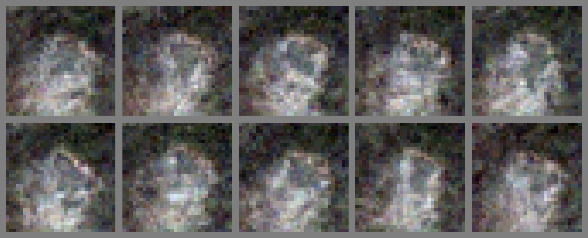

# Flow Generator Matching distillation

This is an official implementation and corresponding experiments on [Flow Generator Matching (FGM)](https://arxiv.org/pdf/2410.19310) - an innovative approach designed to accelerate the sampling of flow-matching models into a one-step generation.

## Flow Generator Matching

The goal is to train a one-step generator model $$g_\theta$$ that directly maps random noise $$z \sim p_z$$ to a sample $$x = g_\theta(z)$$.  
Let $$p_{\theta,0}$$ denote the student model’s distribution over the generated samples $$x$$, and let $$p_{\theta,t}$$ denote the marginal probability path transitioned by $$q_t(x_t \mid x_0)$$. Formally:

$$
p_{\theta,t}(x_t) = \int q_t\bigl(x_t \mid x_0\bigr) p_{\theta,0}(x_0) dx_0
$$

A one-step flow generator matching aims to let the student distribution $$p_{\theta,0}$$ match the data distribution $$q_0$$. To achieve this, we match the marginal vector field $$v_{\theta,t}$$ with the pre-trained one $$u_t$$, such that $$p_{\theta,0}$$ and $$q_0$$ coincide:

$$
L_{FM}(\theta) 
:= E_{t,x_t \sim p_{\theta,t}}
\lVert v_{\theta,t}(x_t) - u_t(x_t)\rVert^2
$$

$$
= E_{\substack{
t,z \sim p_z(z),
x_{0} = g_{\theta}(z),\\
x_t \sim q_t\bigl(x_t \mid x_{0}\bigr)
}}
\lVert v_{\theta,t}(x_t) - u_t(x_t)\rVert^2 
\longrightarrow \min_{\theta}
$$

Our technical report and theoretical explanations of FGM distillations you can find here: [Report](https://drive.google.com/file/d/1YS1KzRWXeIw1R-vZkOWmVUhal0j8_Psz/view?usp=sharing)

### CelebA-64

### CIFAR-10

### MNIST

### Authors

- Vladislav Gromadskii
- Arseny Ivanov
- Daniil Tohchukov

